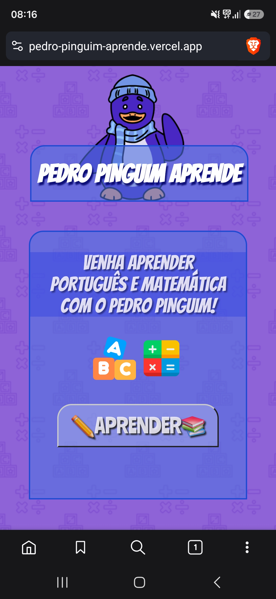

# Pedro Pinguim Aprende

Site para crianças da pré-escola praticarem português e matemática com o Pedro Pinguim, um pinguim de gorro e cachecol que guia as atividades.

- Site: https://pedro-pinguim-aprende.vercel.app/
- Repositório: https://github.com/MateusMoreira-hub/Pedro-Pinguim-Aprende

Projeto da disciplina Fábrica de Software (4º Período A). Este repositório tem a primeira entrega, o MVP, de 08/10/2026.

## Sobre o projeto

Muitas crianças não se interessam pelos assuntos da escola. Isso atrapalha o aprendizado delas e também o trabalho de professores e diretores, que precisam lidar com alunos desmotivados.

A gente quis fazer algo para ajudar nisso: um site onde a criança aprende jogando. Tem um personagem que lê as perguntas em voz alta, dá pontos e comemora os acertos.

Nesta primeira versão são duas matérias, português e matemática, com atividades curtas em que a criança responde tocando na tela.

## Como o projeto foi andando

Começamos definindo o problema (a falta de interesse das crianças) e quem sofre com ele (professores, diretores e as próprias crianças). Dali veio a ideia de um mascote que acompanhasse a criança o tempo todo. O Pedro Pinguim acabou virando a cara do projeto, com um fundo roxo animado cheio de letras, números e sinais de conta.

Como o prazo era curto, fechamos o escopo no que mostrava a solução funcionando: escolher a matéria, responder as atividades, ver pontuação e elogios, ouvir as perguntas e ter música de fundo. A tela de configurações, os níveis de dificuldade e o salvamento do progresso ficaram para depois.

No meio do caminho apareceram alguns problemas. A leitura em voz alta falhava em alguns navegadores, a música depende da internet e a tela de configurações estava crescendo mais do que dava para terminar. Como cada um foi resolvido está na seção de riscos, mais abaixo.

Hoje o MVP está publicado e funcionando. O que falta para o produto final está em "O que ainda falta".

## Problema e público-alvo

O problema é a falta de interesse das crianças pelos assuntos escolares, muitas vezes por causa de um método de ensino pouco atrativo. Quem enfrenta isso são principalmente professores e diretores, além das próprias crianças.

Vale a pena resolver porque, com um ensino mais atrativo, a criança passa a ter mais vontade de aprender, até os assuntos que normalmente não gostaria de estudar.

O público da aplicação são crianças da pré-escola, com apoio de professores, escolas e responsáveis.

## Objetivos

Objetivo geral: deixar o aprendizado de português e matemática mais divertido para crianças da pré-escola, por meio de uma aplicação web interativa.

Objetivos específicos:

- apresentar conteúdos básicos de forma simples e visual;
- chamar a atenção da criança com personagem, cores, som e animação;
- dar retorno imediato a cada resposta;
- motivar com pontuação, sequência de acertos e mensagens de incentivo;
- ser fácil de usar por crianças pequenas, com botões grandes e perguntas lidas em voz alta;
- funcionar online, sem precisar instalar nada.

## Como funciona

Na página inicial o Pedro Pinguim dá as boas-vindas e a criança toca em "Aprender". Na tela seguinte ela escolhe entre português e matemática. Depois disso vêm as atividades: uma pergunta com três opções de resposta, e a criança toca na que acha certa. Dá para voltar à escolha da matéria pelo botão "Voltar" ou ir para a página inicial tocando no título.



## Funcionalidades do MVP

Português:

- primeira letra: aparece um emoji com uma palavra (por exemplo, 🍎 MAÇÃ) e a criança escolhe com qual letra ela começa;
- vogais e consoantes: a criança diz se a letra mostrada é vogal ou consoante;
- três modos: letras, vogais e "Tudo", que mistura os dois.

Matemática:

- contas de somar e de tirar feitas com frutinhas em emoji, para a criança conseguir contar o que está vendo;
- números de 1 a 5, com soma até 10 e sem resultado negativo;
- três modos: somar, tirar e "Tudo".

Nas duas matérias:

- respostas por toque, com três opções;
- placar de pontos e contagem de acertos seguidos;
- mensagens de elogio e de incentivo;
- botão "Ouvir", que lê a pergunta em voz alta em português do Brasil;
- botão "Nova", que gera outra atividade;
- música de fundo que pode ser ligada e desligada, e que abaixa o volume enquanto o Pedro fala.

## Tecnologias

- HTML5 e CSS3: telas, layout, cores, animação do fundo e visual infantil.
- JavaScript: sorteio das questões, correção das respostas, pontuação e sequência de acertos.
- Web Speech API: leitura das perguntas e dos elogios em voz alta.
- YouTube IFrame API: música de fundo.
- Google Fonts: fontes Bangers e Ranchers.
- Vercel: hospedagem do site.
- GitHub: controle de versão.

## Estrutura do projeto

Os nomes abaixo seguem os caminhos usados nos arquivos. Pode haver pequenas diferenças em relação ao repositório.

```
Pedro-Pinguim-Aprende/
├── index.html             página inicial
├── favicon.ico
├── main.js
├── CSS/
│   └── style.css
├── IMAGE/
│   ├── Pedro.png          mascote
│   ├── alfabeto.png       ícone de português
│   ├── calculadora.png    ícone de matemática
│   └── Fundo.png          fundo animado
├── HTML/
│   ├── materia.html       escolha da matéria
│   ├── portugues.html
│   ├── matematica.html
│   └── configurações.html versão base, ainda sem funções
└── README.md
```

## Como executar

É um site estático, então não tem nada para instalar.

Para ver online, é só abrir https://pedro-pinguim-aprende.vercel.app/

Para rodar na sua máquina:

```bash
git clone https://github.com/MateusMoreira-hub/Pedro-Pinguim-Aprende.git
cd Pedro-Pinguim-Aprende
python -m http.server 8000
```

Depois abra http://localhost:8000 no navegador. O servidor local é necessário porque os arquivos usam caminhos a partir da raiz (como `/CSS/style.css`). Se você abrir o `index.html` direto, o visual pode quebrar. No VS Code, a extensão Live Server também resolve.

Para ouvir a voz e a música é preciso estar com o som ligado e conectado à internet.

## Viabilidade

A solução continua viável. Usamos tecnologias simples e gratuitas (HTML, CSS, JavaScript e Vercel), que a equipe consegue manter, e o escopo coube no prazo da primeira entrega. O único ajuste foi deixar a tela de configurações e as atividades mais avançadas para as próximas etapas.

## Riscos e dificuldades

Voz falhando em alguns navegadores. A leitura das perguntas não funcionava de forma estável. Corrigimos a lógica da voz, colocamos uma pequena pausa antes de falar, usamos uma voz em português quando o aparelho tem, e deixamos a falha silenciosa para não atrapalhar a atividade.

Música dependendo do YouTube e da internet. Sem conexão a música não carrega, e o som podia atrapalhar a fala do Pedro. Agora aparece um aviso quando a música falha e o volume abaixa enquanto o Pedro fala.

Tela de configurações com funções demais. Havia risco de não terminar tudo no prazo. Deixamos a tela como versão base, tiramos o acesso a ela da página inicial e priorizamos as atividades de português e matemática.

Conteúdo muito difícil para a idade. Contas e palavras difíceis poderiam frustrar as crianças. Limitamos os números de 1 a 5 (soma até 10), evitamos resultado negativo e usamos emojis e mensagens de incentivo.

## O que ainda falta

- Terminar a tela de configurações (por exemplo, ligar e desligar música e voz).
- Novas matérias e atividades, como contagem, formas, cores e sílabas.
- Níveis de dificuldade nas duas matérias.
- Salvar o progresso e a pontuação da criança.
- Recompensas e personalização, como medalhas e figurinhas.
- Acompanhamento do desempenho para professores e responsáveis.
- Trocar a música do YouTube por um arquivo de áudio próprio, para funcionar sem internet.
- Organizar o código (hoje há funções repetidas entre as páginas de português e matemática) e melhorar o layout em tablets.

## Equipe

Disciplina Fábrica de Software, 4º Período A.

- Kauã Raphael Lemos de Oliveira (01823587)
- Matheus Novaes Pereira de Melo (01787815)
- João Vitor Andrade de Almeida (01832994)
- Mateus Moreira Alves da Costa (01809727)
- Joilder Henrique Godoy Castro da Rocha (01785329)
- Bergson Flávio Monteiro Ferreira Filho (01840174)
